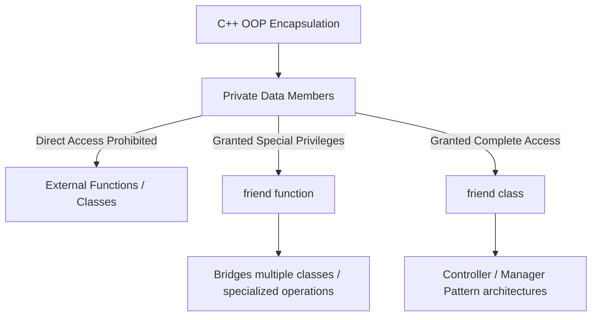
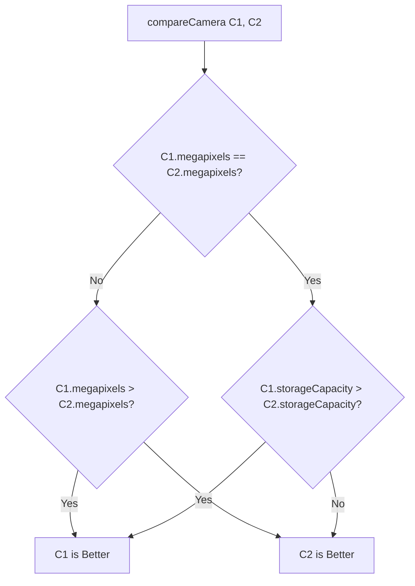

# 🏛️ Object Oriented Programming Laboratory

<div align="center">


<!--  -->


[](https://gcc.gnu.org/)
[](#)
[](#-table-of-contents)
[](#)
[](./OOP_LAB_4_B1.pdf)

<p align="center">
  <b>Department of Computer Science and Engineering</b><br>
  <b>International Institute of Information Technology, Bhubaneswar</b>
</p>

---

</div>

## 📑 Table of Contents

- [🏛️ Object Oriented Programming Laboratory](#️-object-oriented-programming-laboratory)
  - [📑 Table of Contents](#-table-of-contents)
  - [📖 Lab Overview \& Core Objectives](#-lab-overview--core-objectives)
    - [Key Directives from Lab Manual:](#key-directives-from-lab-manual)
  - [🧠 Conceptual Deep Dive](#-conceptual-deep-dive)
    - [1. Friend Function](#1-friend-function)
    - [2. Friend Class](#2-friend-class)
    - [3. Friend Comparison Matrix](#3-friend-comparison-matrix)
  - [📊 Quick Index of Lab Problems](#-quick-index-of-lab-problems)
  - [📝 Problem Statements, Implementations \& Walkthroughs](#-problem-statements-implementations--walkthroughs)
    - [Part I: Friend Functions (Questions 1 – 5)](#part-i-friend-functions-questions-1--5)
      - [🌤️ Q1. Weather Report](#️-q1-weather-report)
      - [🔐 Q2. Two-Factor Login Verification](#-q2-two-factor-login-verification)
      - [📷 Q3. Compare Two Digital Cameras](#-q3-compare-two-digital-cameras)
      - [⚡ Q4. Electricity Usage Alert](#-q4-electricity-usage-alert)
      - [🎟️ Q5. Event Registration Verification](#️-q5-event-registration-verification)
    - [Part II: Friend Classes (Questions 6 – 10)](#part-ii-friend-classes-questions-6--10)
      - [🖨️ Q6. Printer Control System](#️-q6-printer-control-system)
      - [🏛️ Q7. Museum Exhibit Controller](#️-q7-museum-exhibit-controller)
      - [🚗 Q8. Vehicle Service Tracker](#-q8-vehicle-service-tracker)
      - [💳 Q9. Digital Wallet Controller](#-q9-digital-wallet-controller)
      - [🎓 Q10. Classroom Attendance Manager](#-q10-classroom-attendance-manager)
  - [🏗️ Repository Architecture](#️-repository-architecture)
  - [⚙️ Compilation \& Execution Guide](#️-compilation--execution-guide)
    - [Individual Execution](#individual-execution)
    - [One-liner Automated Batch Runner](#one-liner-automated-batch-runner)
    - [Automated Generator (`main.py`)](#automated-generator-mainpy)
  - [🛡️ Encapsulation \& Best Practices Guidelines](#️-encapsulation--best-practices-guidelines)
  - [👥 Authors \& Verification](#-authors--verification)

---

## 📖 Lab Overview & Core Objectives

This laboratory module focuses on **Friend Functions** and **Friend Classes** in C++ as defined in the curriculum of Object-Oriented Programming (Lab 4).

### Key Directives from Lab Manual:
1. **Language:** All solutions strictly engineered in **C++** standard.
2. **Access Control:** Keep all required data members strictly `private` to preserve encapsulation.
3. **Friend Mechanism:** Apply the `friend` keyword only where external functions or controlling classes need direct access to private members.
4. **Clean Formatting:** Produce structured, intuitive, and readable console outputs.



---

## 🧠 Conceptual Deep Dive

### 1. Friend Function
A **friend function** is a non-member function (or a member of another class) that is granted access to the private and protected members of a class.
- Declared inside the class with the `friend` keyword.
- Defined outside class scope without scope resolution operator (`::`).
- Does **not** possess a `this` pointer (requires objects to be passed as arguments).

```cpp
class Weather {
private:
    float temperature;
public:
    // Friend function declaration
    friend void generateReport(Weather w);
};

// Definition outside class scope
void generateReport(Weather w) {
    cout << w.temperature; // Direct access to private member
}
```

### 2. Friend Class
A **friend class** can access private and protected members of the class in which it is declared as a friend.
- Common in **Manager / Controller** paradigms where one class acts as a state manager for another.
- Friendship is **neither mutual nor transitive** (if `A` friends `B`, `B` does not automatically friend `A`).

```cpp
class Printer; // Forward declaration

class Printer {
private:
    double inkLevel;
    friend class PrinterManager; // Grants complete access
};

class PrinterManager {
public:
    void refillInk(Printer &p) {
        p.inkLevel = 100.0; // Direct manipulation of private state
    }
};
```

### 3. Friend Comparison Matrix

| Feature | Regular Member Function | Friend Function | Friend Class |
| :--- | :--- | :--- | :--- |
| **Scope** | Inside Class (`Class::`) | Global / External Scope | Separate Class Scope |
| **Access to `private` members** | Yes | Yes | Yes (all its member functions) |
| **Has `this` pointer** | Yes | No (requires explicit object arg) | Yes (for its own instance) |
| **Inherited by Subclasses?** | Yes (per access rules) | No (Friendship is not inherited) | No |
| **Primary Use Case** | Object behavior & getters/setters | Operator overloading, cross-class bridge | Controller/Manager architecture pattern |

---

## 📊 Quick Index of Lab Problems

| # | Problem Title | Type | Target Class | Friend Entity | Directory Link |
| :---: | :--- | :---: | :--- | :--- | :---: |
| **01** | [Weather Report](#️-q1-weather-report) | `friend func` | `Weather` | `generateReport()` | [`Q1_Weather_Report/`](./Q1_Weather_Report/) |
| **02** | [Two-Factor Login](#-q2-two-factor-login-verification) | `friend func` | `UserAccount` | `checkAccount()` | [`Q2_Two_Factor_Login/`](./Q2_Two_Factor_Login/) |
| **03** | [Compare Two Digital Cameras](#-q3-compare-two-digital-cameras) | `friend func` | `Camera` | `compareCamera()` | [`Q3_Compare_Two_Digital_Cameras/`](./Q3_Compare_Two_Digital_Cameras/) |
| **04** | [Electricity Usage Alert](#-q4-electricity-usage-alert) | `friend func` | `ElectricMeter` | `checkUsage()` | [`Q4_Electricity_Usage_Alert/`](./Q4_Electricity_Usage_Alert/) |
| **05** | [Event Registration Verification](#️-q5-event-registration-verification) | `friend func` | `EventParticipant` | `verifyParticipant()` | [`Q5_Event_Registration_Verification/`](./Q5_Event_Registration_Verification/) |
| **06** | [Printer Control System](#️-q6-printer-control-system) | `friend class` | `Printer` | `PrinterManager` | [`Q6_Printer_Control_System/`](./Q6_Printer_Control_System/) |
| **07** | [Museum Exhibit Controller](#️-q7-museum-exhibit-controller) | `friend class` | `Exhibit` | `MuseumManager` | [`Q7_Museum_Exhibit_Controller/`](./Q7_Museum_Exhibit_Controller/) |
| **08** | [Vehicle Service Tracker](#-q8-vehicle-service-tracker) | `friend class` | `VehicleService` | `ServiceManager` | [`Q8_Vehicle_Service_Tracker/`](./Q8_Vehicle_Service_Tracker/) |
| **09** | [Digital Wallet Controller](#-q9-digital-wallet-controller) | `friend class` | `DigitalWallet` | `WalletManager` | [`Q9_Digital_Wallet_Controller/`](./Q9_Digital_Wallet_Controller/) |
| **10** | [Classroom Attendance Manager](#-q10-classroom-attendance-manager) | `friend class` | `Classroom` | `AttendanceManager` | [`Q10_Classroom_Attendance_Manager/`](./Q10_Classroom_Attendance_Manager/) |

---

## 📝 Problem Statements, Implementations & Walkthroughs

### Part I: Friend Functions (Questions 1 – 5)

---

#### 🌤️ Q1. Weather Report
* **Path:** [`Q1_Weather_Report/`](./Q1_Weather_Report/) | [Source Code](./Q1_Weather_Report/main.cpp) | [Sample Output](./Q1_Weather_Report/output.txt)
* **Concept:** Friend Function accessing private atmospheric properties.

> **Problem Statement:**
> Create a class named `Weather` containing private data members:
> - `cityName` (`string`)
> - `temperature` (`float`)
> - `weatherCondition` (`string`)
>
> Write a friend function named `generateReport()` that accesses private members and displays a suitable weather report according to the following classification:
> - **Above $35^\circ\text{C}$**: `Very Hot`
> - **$20^\circ\text{C}$ to $35^\circ\text{C}$**: `Pleasant`
> - **Below $20^\circ\text{C}$**: `Cool`

```
+-------------------------------------------------------+
|                       Weather                         |
+-------------------------------------------------------+
| - cityName: string                                    |
| - temperature: float                                  |
| - weatherCondition: string                            |
+-------------------------------------------------------+
| + Weather(city: string, temp: float, cond: string)    |
| + friend void generateReport(Weather current)         |
+-------------------------------------------------------+
```

<details>
<summary><b>🔍 View Execution Sample</b></summary>

```text
City: Bhubaneswar
Temperature: 32 °C
Condition: Sunny
Classification: Pleasant
```
</details>

---

#### 🔐 Q2. Two-Factor Login Verification
* **Path:** [`Q2_Two_Factor_Login/`](./Q2_Two_Factor_Login/) | [Source Code](./Q2_Two_Factor_Login/main.cpp) | [Sample Output](./Q2_Two_Factor_Login/output.txt)
* **Concept:** Security state verification via Friend Function.

> **Problem Statement:**
> Create a class named `UserAccount` containing private data members:
> - `username` (`string`)
> - `loginAttempts` (`int`)
> - `accountStatus` (`string` or state evaluation)
>
> Write a friend function `checkAccount(UserAccount)` that inspects the private members. If the number of unsuccessful login attempts is **$\ge 3$**, display **"Account Locked"**; otherwise display **"Account Active"**. Also display the username and login attempt count.

<details>
<summary><b>🔍 View Execution Sample</b></summary>

```text
Username: Ramesh Pandey
Login Attempts: 2
Account Status: Active
```
</details>

---

#### 📷 Q3. Compare Two Digital Cameras
* **Path:** [`Q3_Compare_Two_Digital_Cameras/`](./Q3_Compare_Two_Digital_Cameras/) | [Source Code](./Q3_Compare_Two_Digital_Cameras/main.cpp) | [Sample Output](./Q3_Compare_Two_Digital_Cameras/output.txt)
* **Concept:** Dual-object comparison across private attributes via Friend Function.

> **Problem Statement:**
> Create a class named `Camera` containing private data members:
> - `brand` (`string`), `model` (`string`), `megapixels` (`int`), `storageCapacity` (`int`)
>
> Write a friend function named `compareCamera(Camera c1, Camera c2)` to evaluate which camera is superior:
> 1. Higher megapixels is considered better.
> 2. If megapixels are equal, higher storage capacity wins.
> 3. Display the comprehensive details of the winning camera.



<details>
<summary><b>🔍 View Execution Sample</b></summary>

```text
Enter camera 1 details: 
Brand: Sony 
Model: A550
Megapixels: 250
Storage(GB): 64

Enter camera 2 details: 
Brand: Red Hydrogen
Model: H1B
Megapixels: 450
Storage(GB): 128

--- BETTER CAMERA DETAILS ---
Brand: Red Hydrogen
Model: H1B
Megapixels: 450
Storage: 128 GB
```
</details>

---

#### ⚡ Q4. Electricity Usage Alert
* **Path:** [`Q4_Electricity_Usage_Alert/`](./Q4_Electricity_Usage_Alert/) | [Source Code](./Q4_Electricity_Usage_Alert/main.cpp) | [Sample Output](./Q4_Electricity_Usage_Alert/output.txt)
* **Concept:** Tiered usage categorization using a Friend Function.

> **Problem Statement:**
> Create a class named `ElectricMeter` containing private data members:
> - `meterNumber` (`int`)
> - `consumerName` (`string`)
> - `unitsConsumed` (`int`)
>
> Write a friend function named `checkUsage(ElectricMeter)` to categorize electricity consumption:
> - **$< 100\text{ units}$**: `Low Usage`
> - **$100\text{ to }300\text{ units}$**: `Moderate Usage`
> - **$> 300\text{ units}$**: `High Usage`

<details>
<summary><b>🔍 View Execution Sample</b></summary>

```text
Enter meter number: 2231
Enter consumer name: Ramesh Jaiswal
Enter units consumed: 129

Customer Details are as follows: 
Meter Number: 2231
Consumer Name: Ramesh Jaiswal
Units Consumed: 129
Usage: Moderate Usage
```
</details>

---

#### 🎟️ Q5. Event Registration Verification
* **Path:** [`Q5_Event_Registration_Verification/`](./Q5_Event_Registration_Verification/) | [Source Code](./Q5_Event_Registration_Verification/main.cpp) | [Sample Output](./Q5_Event_Registration_Verification/output.txt)
* **Concept:** Multi-condition verification using a Friend Function.

> **Problem Statement:**
> Create a class named `EventParticipant` containing private data members:
> - `participantName` (`string`)
> - `age` (`int`)
> - `registrationStatus` (`string`)
>
> Write a friend function `verifyParticipant(EventParticipant)` to validate eligibility:
> - **Eligible Condition:** `Age >= 18` **AND** `Registration Status == Active` (case-insensitive handling).
> - Display participant summary and either **"Eligible"** or **"Not Eligible"**.

<details>
<summary><b>🔍 View Execution Sample</b></summary>

```text
Enter participant name: Ramesh Pandey
Enter age: 45
Enter registration status: ActIvE

Participant: Ramesh Pandey
Age: 45
Registration Status: Active
Eligible
```
</details>

---

### Part II: Friend Classes (Questions 6 – 10)

---

#### 🖨️ Q6. Printer Control System
* **Path:** [`Q6_Printer_Control_System/`](./Q6_Printer_Control_System/) | [Source Code](./Q6_Printer_Control_System/main.cpp) | [Sample Output](./Q6_Printer_Control_System/output.txt)
* **Concept:** Hardware management model using a Friend Class.

> **Problem Statement:**
> Create classes `Printer` and `PrinterManager`.
> - **`Printer` private fields:** `printerName` (`string`), `pagesPrinted` (`int`), `inkLevel` (`double`), `powerStatus` (`bool`).
> - Declare `PrinterManager` as a `friend class` of `Printer`.
> - **`PrinterManager` capabilities:**
>   1. `displayInfo()` – Display complete printer status.
>   2. `turnOn()` / `turnOff()` – Modify power state.
>   3. `checkInkLevel()` – Report remaining percentage.
>   4. `resetPageCount()` – Reset pages printed to 0.

<details>
<summary><b>🔍 View Execution Sample</b></summary>

```text
Enter printer name: HP Sonic
Enter pages printed: 45
Enter ink level (%): 98
Enter power status (1 for ON, 0 for OFF): 1

Printer Information:
Printer: HP Sonic
Pages Printed: 45
Ink Level: 98%
Power: ON
```
</details>

---

#### 🏛️ Q7. Museum Exhibit Controller
* **Path:** [`Q7_Museum_Exhibit_Controller/`](./Q7_Museum_Exhibit_Controller/) | [Source Code](./Q7_Museum_Exhibit_Controller/main.cpp) | [Sample Output](./Q7_Museum_Exhibit_Controller/output.txt)
* **Concept:** State & audience tracking via Friend Class controller.

> **Problem Statement:**
> Create classes `Exhibit` and `MuseumManager`.
> - **`Exhibit` private fields:** `exhibitName` (`string`), `exhibitID` (`int`), `visitorCount` (`int`), `displayStatus` (`bool`).
> - Declare `MuseumManager` as a `friend class` of `Exhibit`.
> - **`MuseumManager` capabilities:**
>   1. Display exhibit information.
>   2. Add visitors to the exhibit counter.
>   3. Reset visitor count to zero.
>   4. Toggle exhibit open/closed state.
>   5. Check whether the exhibit is currently open.

<details>
<summary><b>🔍 View Execution Sample</b></summary>

```text
Enter exhibit name: Palm Island
Enter exhibit ID: 2342
Enter visitor count: 23 
Enter display status (1 for Open, 0 for Closed): 1

Data Regarding Exhibit
Exhibit: Palm Island
Exhibit ID: 2342
Visitors: 73
Status: Open
```
</details>

---

#### 🚗 Q8. Vehicle Service Tracker
* **Path:** [`Q8_Vehicle_Service_Tracker/`](./Q8_Vehicle_Service_Tracker/) | [Source Code](./Q8_Vehicle_Service_Tracker/main.cpp) | [Sample Output](./Q8_Vehicle_Service_Tracker/output.txt)
* **Concept:** Maintenance scheduling through Friend Class access.

> **Problem Statement:**
> Create classes `VehicleService` and `ServiceManager`.
> - **`VehicleService` private fields:** `vehicleNumber` (`string`), `ownerName` (`string`), `serviceDue` (`bool`), `lastServiceKm` (`int`).
> - Declare `ServiceManager` as a `friend class` of `VehicleService`.
> - **`ServiceManager` capabilities:**
>   1. Display vehicle service record.
>   2. Mark service as completed (`serviceDue = false`).
>   3. Update odometer milestone at last service.
>   4. Query service requirement status.

<details>
<summary><b>🔍 View Execution Sample</b></summary>

```text
Vehicle Number: OD02AB1234
Owner: Rishav
Last Service: 15000 km
Service Due: Yes
Vehicle requires servicing.

After Service:
Vehicle does not require servicing.
```
</details>

---

#### 💳 Q9. Digital Wallet Controller
* **Path:** [`Q9_Digital_Wallet_Controller/`](./Q9_Digital_Wallet_Controller/) | [Source Code](./Q9_Digital_Wallet_Controller/main.cpp) | [Sample Output](./Q9_Digital_Wallet_Controller/output.txt)
* **Concept:** Financial transaction and balance guard using Friend Class.

> **Problem Statement:**
> Create classes `DigitalWallet` and `WalletManager`.
> - **`DigitalWallet` private fields:** `userName` (`string`), `walletBalance` (`double`), `walletStatus` (`bool`).
> - Declare `WalletManager` as a `friend class` of `DigitalWallet`.
> - **`WalletManager` capabilities:**
>   1. Display wallet balance and details.
>   2. Add money to the wallet.
>   3. Deduct money with sufficiency validation (`balance >= amount`).
>   4. Disable / Freeze wallet.
>   5. Check active status before transactions.

<details>
<summary><b>🔍 View Execution Sample</b></summary>

```text
Enter user name: Ramesh Pandey
Enter wallet balance: 20000
Enter wallet status (1 for Active, 0 for Disabled): 1

--USER DETAILS--
User: Ramesh Pandey
Balance: Rs. 20000
Status: Active
Enter amount to add: 4000
Updated Balance: Rs. 24000
```
</details>

---

#### 🎓 Q10. Classroom Attendance Manager
* **Path:** [`Q10_Classroom_Attendance_Manager/`](./Q10_Classroom_Attendance_Manager/) | [Source Code](./Q10_Classroom_Attendance_Manager/main.cpp) | [Sample Output](./Q10_Classroom_Attendance_Manager/output.txt)
* **Concept:** Computed metric derivation (`Absent = Total - Present`) via Friend Class.

> **Problem Statement:**
> Create classes `Classroom` and `AttendanceManager`.
> - **`Classroom` private fields:** `className` (`string`), `totalStudents` (`int`), `presentStudents` (`int`), `attendanceStatus` (`bool`).
> - Declare `AttendanceManager` as a `friend class` of `Classroom`.
> - **`AttendanceManager` capabilities:**
>   1. Display classroom roster overview.
>   2. Update the tally of present students.
>   3. Finalize attendance status.
>   4. Report whether attendance is finalized.
>   5. Calculate & display absent count: $\text{Absent Students} = \text{Total Students} - \text{Present Students}$.

<details>
<summary><b>🔍 View Execution Sample</b></summary>

```text
Enter class name: CSE B
Enter total students: 100
Enter present students: 90
Enter attendance status (1 for Completed, 0 for Not Completed): 1

--CLASS DETAILS--
Class: CSE B
Total Students: 100
Present Students: 90
Attendance: Completed
Absent Students: 10
```
</details>

---

## 🏗️ Repository Architecture

```plaintext
OOP-LAB4/
│
├── 📄 README.md                             # Comprehensive project documentation
├── 📕 OOP_LAB_4_B1.pdf                      # Official laboratory manual & problem specifications
├── 🐍 main.py                               # Scaffold / Automation script for directories
│
├── 📂 Q1_Weather_Report/                    # Q1: Friend Function (Atmospheric classification)
│   ├── main.cpp
│   └── output.txt
├── 📂 Q2_Two_Factor_Login/                  # Q2: Friend Function (Account lockout verification)
│   ├── main.cpp
│   └── output.txt
├── 📂 Q3_Compare_Two_Digital_Cameras/       # Q3: Friend Function (Cross-object camera comparison)
│   ├── main.cpp
│   └── output.txt
├── 📂 Q4_Electricity_Usage_Alert/           # Q4: Friend Function (Power tariff bracket check)
│   ├── main.cpp
│   └── output.txt
├── 📂 Q5_Event_Registration_Verification/   # Q5: Friend Function (Age & active registration audit)
│   ├── main.cpp
│   └── output.txt
├── 📂 Q6_Printer_Control_System/            # Q6: Friend Class (Printer hardware manager)
│   ├── main.cpp
│   └── output.txt
├── 📂 Q7_Museum_Exhibit_Controller/         # Q7: Friend Class (Exhibit footfall & state controller)
│   ├── main.cpp
│   └── output.txt
├── 📂 Q8_Vehicle_Service_Tracker/           # Q8: Friend Class (Automobile maintenance log)
│   ├── main.cpp
│   └── output.txt
├── 📂 Q9_Digital_Wallet_Controller/         # Q9: Friend Class (Financial debit/credit manager)
│   ├── main.cpp
│   └── output.txt
└── 📂 Q10_Classroom_Attendance_Manager/     # Q10: Friend Class (Student attendance derivation)
    ├── main.cpp
    └── output.txt
```

---

## ⚙️ Compilation & Execution Guide

### Individual Execution
You can compile and run any question with standard `g++` (C++17 or later):

```bash
# Compile Question 1
g++ -std=c++17 -Wall Q1_Weather_Report/main.cpp -o Q1_Weather_Report/main

# Run Question 1
./Q1_Weather_Report/main
```

### One-liner Automated Batch Runner
To compile and test all 10 programs in sequence:

```bash
for dir in Q*; do
    if [ -f "$dir/main.cpp" ]; then
        echo "=========================================="
        echo "Compiling & Running: $dir"
        echo "=========================================="
        g++ -std=c++17 "$dir/main.cpp" -o "$dir/main" && ./"$dir/main"
    fi
done
```

### Automated Generator (`main.py`)
The project includes a lightweight Python utility to bootstrap clean question workspaces:
```bash
python3 main.py
```

---

## 🛡️ Encapsulation & Best Practices Guidelines

1. **Principle of Least Privilege:** Grant friendship status only to functions or classes that genuinely require direct access to private state.
2. **Encapsulation Protection:** Keep member variables strictly `private`. Friend entities act as controlled gates rather than exposing public variables.
3. **No Hidden Transitivity:** Remember that if Class $A$ declares Class $B$ as a friend, Class $B$ cannot access private members of subclasses of $A$.
4. **Const Correctness:** When passing objects to friend functions for inspection only, prefer `const ClassName &obj` to prevent accidental state mutation.

---

## 👥 Authors & Verification

* **Course:** Object-Oriented Programming (OOP) Laboratory
* **Academic Term:** B.Tech 3rd Semester (CSE B1)
* **Institution:** International Institute of Information Technology, Bhubaneswar
* **Reference Document:** [`OOP_LAB_4_B1.pdf`](./OOP_LAB_4_B1.pdf)

<div align="center">

**Made with ❤️ for Object Oriented Programming in C++**

</div>
