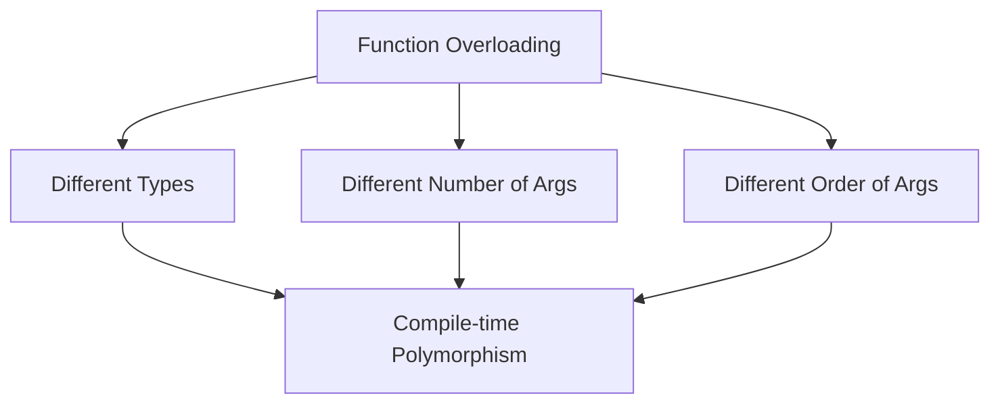

# 🏛️ Object Oriented Programming Laboratory

<div align="center">


<!--  -->


[](https://gcc.gnu.org/)
[](#-table-of-contents)
[](#)
[](./OOP_LAB_5_B1.pdf)

<p align="center">
  <b>Department of Computer Science and Engineering</b><br>
  <b>International Institute of Information Technology, Bhubaneswar</b>
</p>

---

</div>

## 📑 Table of Contents

- [🏛️ Object Oriented Programming Laboratory](#️-object-oriented-programming-laboratory)
  - [📖 Lab Overview \& Core Objectives](#-lab-overview--core-objectives)
  - [🧠 Conceptual Deep Dive](#-conceptual-deep-dive)
  - [📊 Quick Index of Lab Problems](#-quick-index-of-lab-problems)
  - [🏗️ Repository Architecture](#️-repository-architecture)
  - [⚙️ Compilation \& Execution Guide](#️-compilation--execution-guide)
  - [👥 Authors \& Verification](#-authors--verification)

---

## 📖 Lab Overview & Core Objectives

This laboratory module focuses on **Function Overloading** in C++ as defined in the curriculum of Object-Oriented Programming (Lab 5).

### Key Directives from Lab Manual:
1. **Language:** All solutions strictly engineered in **C++** standard.
2. **Function Overloading:** Use the same function name for overloaded versions, differentiating them using the number, type, or order of parameters.
3. **Pointers & Arrays:** Pointers and arrays should be effectively utilized and passed as function parameters wherever specified.
4. **Clean Formatting:** Display output in a neat and readable format.



---

## 🧠 Conceptual Deep Dive

### Function Overloading
Function Overloading is a feature of Object Oriented Programming where two or more functions can have the same name but different parameters. It is an example of **Compile-time Polymorphism**. 

The compiler distinguishes these functions by their **signature**, which encompasses:
- The **number** of parameters.
- The **data type** of parameters.
- The **order** of parameters.

```cpp
// Overloaded based on type
void convert(int m);
void convert(double km);

// Overloaded based on number of parameters
void process(int arr[], int size);
void process(int arr[], int size, int k);
```

---

## 📊 Quick Index of Lab Problems

| # | Problem Title | Overloaded Function | Directory Link |
| :---: | :--- | :--- | :---: |
| **01** | Distance Converter | `convert()` | [`Q01_Distance_Converter/`](./Q01_Distance_Converter/) |
| **02** | Area Calculator | `area()` | [`Q02_Area_Calculator/`](./Q02_Area_Calculator/) |
| **03** | Character Analyzer | `check()` | [`Q03_Character_Analyzer/`](./Q03_Character_Analyzer/) |
| **04** | Array Processing | `process()` | [`Q04_Array_Processing/`](./Q04_Array_Processing/) |
| **05** | Swap Values | `swapData()` | [`Q05_Swap_Values/`](./Q05_Swap_Values/) |
| **06** | String Information | `information()` | [`Q06_String_Information/`](./Q06_String_Information/) |
| **07** | Nearest Value | `nearValue()` | [`Q07_Nearest_Value/`](./Q07_Nearest_Value/) |
| **08** | Update Array Elements | `update()` | [`Q08_Update_Array_Elements/`](./Q08_Update_Array_Elements/) |
| **09** | Data Inspection Using Pointers | `inspect()` | [`Q09_Data_Inspection_Using_Pointers/`](./Q09_Data_Inspection_Using_Pointers/) |
| **10** | Result Evaluator | `evaluate()` | [`Q10_Result_Evaluator/`](./Q10_Result_Evaluator/) |

---

## 🏗️ Repository Architecture

```plaintext
OOP-LAB5/
│
├── 📄 README.md                             # Comprehensive project documentation
├── 📕 OOP_LAB_5_B1.pdf                      # Official laboratory manual & problem specifications
├── 🐍 main.py                               # Scaffold / Automation script for directories
│
├── 📂 Q01_Distance_Converter/               # Q1: Function Overloading by parameter types
│   ├── main.cpp
│   └── output.txt
├── 📂 Q02_Area_Calculator/                  # Q2: Overloading with number and types of parameters
│   ├── main.cpp
│   └── output.txt
├── 📂 Q03_Character_Analyzer/               # Q3: Checking types (int, char, array)
│   ├── main.cpp
│   └── output.txt
├── 📂 Q04_Array_Processing/                 # Q4: Array manipulation with overloaded sums
│   ├── main.cpp
│   └── output.txt
├── 📂 Q05_Swap_Values/                      # Q5: Pass by reference and pass by pointer
│   ├── main.cpp
│   └── output.txt
├── 📂 Q06_String_Information/               # Q6: String analysis with dynamic memory & parameters
│   ├── main.cpp
│   └── output.txt
├── 📂 Q07_Nearest_Value/                    # Q7: Finding absolute nearest values to zero
│   ├── main.cpp
│   └── output.txt
├── 📂 Q08_Update_Array_Elements/            # Q8: Value mutation via reference and array parameters
│   ├── main.cpp
│   └── output.txt
├── 📂 Q09_Data_Inspection_Using_Pointers/   # Q9: Data observation using value and pointer types
│   ├── main.cpp
│   └── output.txt
└── 📂 Q10_Result_Evaluator/                 # Q10: Computing averages with var args and types
    ├── main.cpp
    └── output.txt
```

---

## ⚙️ Compilation & Execution Guide

### Individual Execution
You can compile and run any question with standard `g++` (C++17 or later):

```bash
# Compile Question 1
g++ -std=c++17 -Wall Q01_Distance_Converter/main.cpp -o Q01_Distance_Converter/main

# Run Question 1
./Q01_Distance_Converter/main
```

---

## 👥 Authors & Verification

* **Course:** Object-Oriented Programming (OOP) Laboratory
* **Academic Term:** B.Tech 3rd Semester (CSE B1)
* **Institution:** International Institute of Information Technology, Bhubaneswar
* **Reference Document:** [`OOP_LAB_5_B1.pdf`](./OOP_LAB_5_B1.pdf)

<div align="center">

**Made with ❤️ for Object Oriented Programming in C++**

</div>
