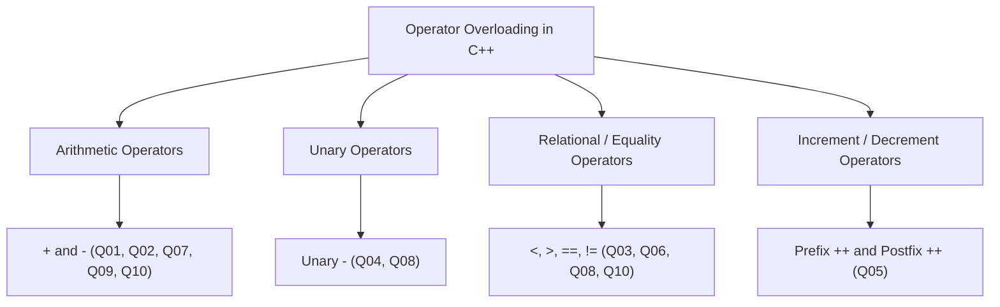
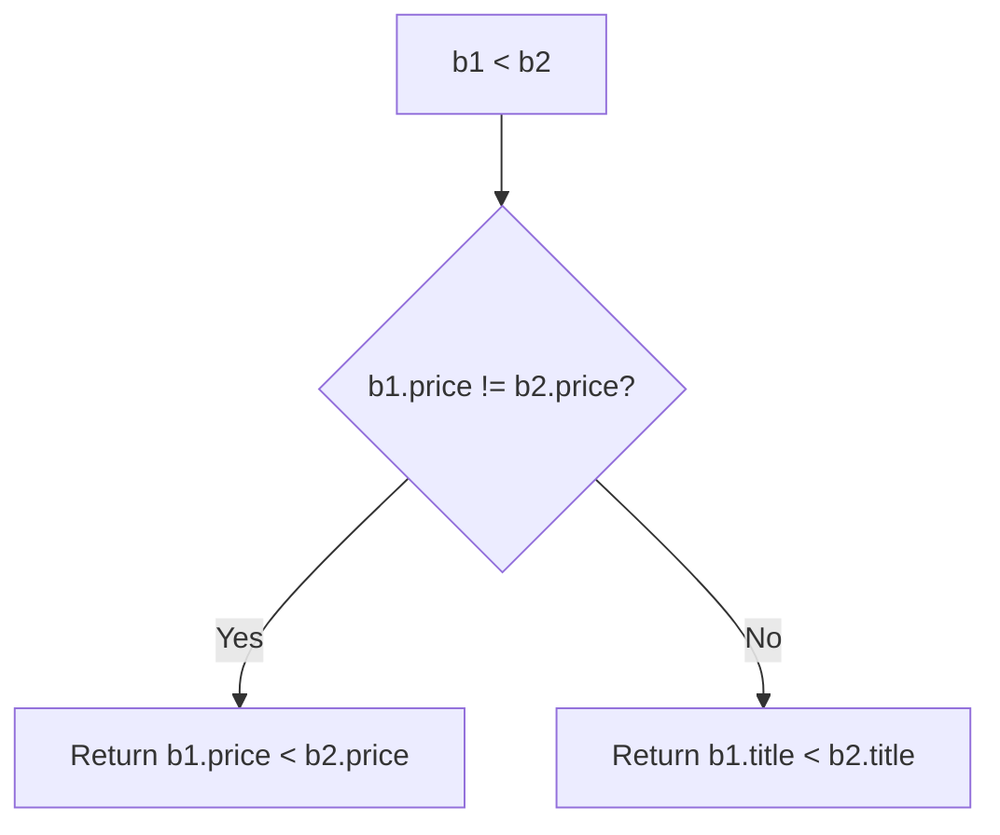

# 🏛️ Object Oriented Programming Laboratory

<div align="center">


<!--  -->


[](https://gcc.gnu.org/)
[](#)
[](#-table-of-contents)
[](#)
[.pdf-red?style=flat-square&logo=adobeacrobatreader)](./OOP_LAB_6_CSE_B1%20(1).pdf)

<p align="center">
  <b>Department of Computer Science and Engineering</b><br>
  <b>International Institute of Information Technology, Bhubaneswar</b>
</p>

---

</div>

## 📑 Table of Contents

- [🏛️ Object Oriented Programming Laboratory](#️-object-oriented-programming-laboratory)
  - [📑 Table of Contents](#-table-of-contents)
  - [📖 Lab Overview \& Core Objectives](#-lab-overview--core-objectives)
    - [Key Directives from Lab Manual:](#key-directives-from-lab-manual)
  - [🧠 Conceptual Deep Dive: Operator Overloading](#-conceptual-deep-dive-operator-overloading)
    - [1. Binary Operators](#1-binary-operators)
    - [2. Unary Operators \& Prefix vs. Postfix](#2-unary-operators--prefix-vs-postfix)
    - [3. Relational and Equality Operators](#3-relational-and-equality-operators)
    - [4. Operator Overloading Rules \& Restrictions](#4-operator-overloading-rules--restrictions)
    - [5. Operator Overloading Classification Matrix](#5-operator-overloading-classification-matrix)
  - [📊 Quick Index of Lab Problems](#-quick-index-of-lab-problems)
  - [📝 Problem Statements, Implementations \& Walkthroughs](#-problem-statements-implementations--walkthroughs)
    - [➕ Q01. Fraction Calculator – Addition and Subtraction](#-q01-fraction-calculator--addition-and-subtraction)
    - [⏱️ Q02. Time Duration Calculator](#️-q02-time-duration-calculator)
    - [📚 Q03. Book Price Ranking](#-q03-book-price-ranking)
    - [💳 Q04. Unary Operator – Account Adjustment](#-q04-unary-operator--account-adjustment)
    - [🔢 Q05. Score Tracker – Prefix and Postfix Increment](#-q05-score-tracker--prefix-and-postfix-increment)
    - [📅 Q06. Date Equality and Inequality](#-q06-date-equality-and-inequality)
    - [📦 Q07. Inventory Combination](#-q07-inventory-combination)
    - [🌡️ Q08. Temperature Comparison](#️-q08-temperature-comparison)
    - [🧮 Q09. Matrix Addition](#-q09-matrix-addition)
    - [🧾 Q10. Shopping Bill Operations](#-q10-shopping-bill-operations)
  - [🏗️ Repository Architecture](#️-repository-architecture)
  - [⚙️ Compilation \& Execution Guide](#️-compilation--execution-guide)
    - [Individual Execution](#individual-execution)
    - [Batch Compilation and Execution](#batch-compilation-and-execution)
  - [🛡️ Encapsulation \& Operator Overloading Best Practices](#️-encapsulation--operator-overloading-best-practices)
  - [👥 Authors \& Verification](#-authors--verification)

---

## 📖 Lab Overview & Core Objectives

This laboratory module focuses on **Operator Overloading** in C++ as specified in the Object-Oriented Programming (Lab 6) curriculum.

### Key Directives from Lab Manual:
1. **Language:** All solutions strictly engineered in **C++** standard (`-std=c++17` or later).
2. **Object-Oriented Design:** Implement classes and objects to model all entities with proper encapsulation.
3. **Targeted Overloading:** Overload **only** the operators explicitly specified in each problem statement.
4. **Immutability of Operands:** Do **not** modify original objects unless explicitly required (e.g. mutating increment `++` vs pure binary arithmetic `+`).
5. **Clean Formatting:** Display crisp, meaningful, and verifiable console outputs for each problem.



---

## 🧠 Conceptual Deep Dive: Operator Overloading

Operator overloading is a compile-time polymorphism feature in C++ allowing user-defined types to exhibit intuitive, idiomatic syntax identical to built-in primitive types.

### 1. Binary Operators
A binary operator takes two operands. When overloaded as a member function, the left-hand operand is implicitly bound to `*this`, and the right-hand operand is passed as a parameter:

$$\text{Result} = \text{Obj}_1 + \text{Obj}_2 \iff \text{Obj}_1.\text{operator+}(\text{Obj}_2)$$

```cpp
Fraction operator+(const Fraction& f) const {
    return Fraction(numerator * f.denominator + f.numerator * denominator,
                    denominator * f.denominator);
}
```

### 2. Unary Operators & Prefix vs. Postfix
Unary operators take a single operand:

$$\text{Result} = -\text{Obj} \iff \text{Obj}.\text{operator-}()$$

For increment and decrement operators, C++ distinguishes **prefix** and **postfix** using a dummy `int` parameter:
- **Prefix (`++obj`):** Increments first and returns a reference to the updated object (`*this`).
- **Postfix (`obj++`):** Captures current state, increments the object, and returns the old state by value.

```cpp
// Prefix: ++obj
Score& operator++() {
    ++score;
    return *this;
}

// Postfix: obj++ (dummy int parameter)
Score operator++(int) {
    Score temp = *this;
    ++score;
    return temp;
}
```

### 3. Relational and Equality Operators
Relational (`<`, `>`) and equality (`==`, `!=`) operators return `bool` values:
```cpp
bool operator==(const Date& dt) const {
    return day == dt.day && month == dt.month && year == dt.year;
}

bool operator!=(const Date& dt) const {
    return !(*this == dt);
}
```

### 4. Operator Overloading Rules & Restrictions
1. **Precedence and Associativity:** Cannot be altered; they follow built-in C++ rules.
2. **Arity:** Number of operands cannot change (binary remains binary, unary remains unary).
3. **Non-overloadable Operators:**
   - Scope Resolution (`::`)
   - Member Access (`.`)
   - Pointer-to-Member (`.*`)
   - Ternary Conditional (`?:`)
   - `sizeof`, `typeid`, `alignof`
4. **Cannot Create New Symbols:** Cannot invent arbitrary operators like `**` or `<=>` unless supported by the standard.

---

### 5. Operator Overloading Classification Matrix

| Category | Operator | Member Signature | Return Type | Typical Semantics | Lab Question |
| :--- | :---: | :--- | :--- | :--- | :---: |
| **Arithmetic** | `+`, `-` | `Type operator+(const Type&) const` | `Type` (by value) | Generates new computed instance | Q01, Q02, Q07, Q09, Q10 |
| **Unary Negation** | `-` | `Type operator-() const` | `Type` (by value) | Inverts sign, original unchanged | Q04, Q08 |
| **Prefix Increment** | `++` | `Type& operator++()` | `Type&` (by ref) | Increments in place, returns `*this` | Q05 |
| **Postfix Increment**| `++` | `Type operator++(int)` | `Type` (by value) | Increments in place, returns old copy | Q05 |
| **Equality** | `==`, `!=` | `bool operator==(const Type&) const` | `bool` | True if all core fields match | Q06 |
| **Relational** | `<`, `>` | `bool operator<(const Type&) const` | `bool` | Strict weak ordering evaluation | Q03, Q08, Q10 |

---

## 📊 Quick Index of Lab Problems

| # | Problem Title | Overloaded Operators | Key Concept | Directory Link |
| :---: | :--- | :---: | :--- | :---: |
| **01** | [Fraction Calculator](#-q01-fraction-calculator--addition-and-subtraction) | `+`, `-` | Binary arithmetic with GCD simplification | [`Q01_Fraction_Calculator/`](./Q01_Fraction_Calculator/) |
| **02** | [Time Duration Calculator](#️-q02-time-duration-calculator) | `+` | Time addition with minute normalization ($\ge 60$) | [`Q02_Time_Duration_Calculator/`](./Q02_Time_Duration_Calculator/) |
| **03** | [Book Price Ranking](#-q03-book-price-ranking) | `<` | Price comparison with lexicographical tie-breaker | [`Q03_Book_Price_Ranking/`](./Q03_Book_Price_Ranking/) |
| **04** | [Unary Operator – Account](#-q04-unary-operator--account-adjustment) | Unary `-` | Negating balance while preserving original object | [`Q04_Unary_Operator/`](./Q04_Unary_Operator/) |
| **05** | [Score Tracker](#-q05-score-tracker--prefix-and-postfix-increment) | Prefix `++`, Postfix `++` | Difference between `++obj` and `obj++` | [`Q05_Score_Tracker/`](./Q05_Score_Tracker/) |
| **06** | [Date Equality & Inequality](#-q06-date-equality-and-inequality) | `==`, `!=` | Date field comparison and inverse boolean logic | [`Q06_Date_Equality/`](./Q06_Date_Equality/) |
| **07** | [Inventory Combination](#-q07-inventory-combination) | `+` | Conditional merging on matching ID and unit price | [`Q07_Inventory_Combination/`](./Q07_Inventory_Combination/) |
| **08** | [Temperature Comparison](#️-q08-temperature-comparison) | `>`, `<`, Unary `-` | Relational ordering and sign negation | [`Q08_Temperature_Comparison/`](./Q08_Temperature_Comparison/) |
| **09** | [Matrix Addition](#-q09-matrix-addition) | `+` | Element-wise $2 \times 2$ matrix addition | [`Q09_Matrix_Addition/`](./Q09_Matrix_Addition/) |
| **10** | [Shopping Bill Operations](#-q10-shopping-bill-operations) | `+`, `>` | Item count / amount sum and bill comparison | [`Q10_Shopping_Bill_Operations/`](./Q10_Shopping_Bill_Operations/) |

---

## 📝 Problem Statements, Implementations & Walkthroughs

---

### ➕ Q01. Fraction Calculator – Addition and Subtraction
* **Path:** [`Q01_Fraction_Calculator/`](./Q01_Fraction_Calculator/) | [Source Code](./Q01_Fraction_Calculator/main.cpp) | [Sample Output](./Q01_Fraction_Calculator/output.txt)
* **Concept:** Binary `+` and `-` operators, GCD reduction, positive denominator enforcement.

> **Problem Statement:**
> Create a class `Fraction` containing a numerator and a denominator. Overload the binary `+` and `-` operators to add and subtract two fractions. Simplify each resulting fraction using the greatest common divisor (GCD). Ensure that the denominator of the final result is positive.
> 
> *Hint:* Use a separate helper function to simplify the fraction.

```
+-------------------------------------------------------+
|                       Fraction                        |
+-------------------------------------------------------+
| - numerator: int                                      |
| - denominator: int                                    |
+-------------------------------------------------------+
| - simplify(): void                                    |
| + Fraction(n: int, d: int)                            |
| + operator+(f: const Fraction&) const: Fraction       |
| + operator-(f: const Fraction&) const: Fraction       |
| + display() const: void                               |
+-------------------------------------------------------+
```

<details>
<summary><b>🔍 View Execution Sample</b></summary>

```text
f1 = 3/4
f2 = 4/3
f1 + f2 = 25/12
f1 - f2 = -7/12
Originals unchanged: f1 = 3/4, f2 = 4/3
```
</details>

---

### ⏱️ Q02. Time Duration Calculator
* **Path:** [`Q02_Time_Duration_Calculator/`](./Q02_Time_Duration_Calculator/) | [Source Code](./Q02_Time_Duration_Calculator/main.cpp) | [Sample Output](./Q02_Time_Duration_Calculator/output.txt)
* **Concept:** Binary `+` operator, time normalization ($\text{minutes} < 60$).

> **Problem Statement:**
> Create a class `Duration` containing hours and minutes. Overload the binary `+` operator to add two duration objects. Normalize the result so that minutes are always less than 60. Return a new object and display both the original durations and the resulting duration.

<details>
<summary><b>🔍 View Execution Sample</b></summary>

```text
d1 = 2h 45m
d2 = 1h 30m
d1 + d2 = 4h 15m
```
</details>

---

### 📚 Q03. Book Price Ranking
* **Path:** [`Q03_Book_Price_Ranking/`](./Q03_Book_Price_Ranking/) | [Source Code](./Q03_Book_Price_Ranking/main.cpp) | [Sample Output](./Q03_Book_Price_Ranking/output.txt)
* **Concept:** Relational `<` operator with multi-criteria tie-breaking.

> **Problem Statement:**
> Create a class `Book` containing a book title and price. Overload the `<` operator to compare two books by price. If the prices are equal, the book with the lexicographically smaller title should be considered smaller. Return a Boolean result.



<details>
<summary><b>🔍 View Execution Sample</b></summary>

```text
b1 = "C++ Primer" (Rs. 899)
b2 = "Java Basics" (Rs. 799)
b3 = "Python Guide" (Rs. 799)
b2 < b1 ? true
b2 < b3 ? true  (same price, "Java Basics" < "Python Guide")
```
</details>

---

### 💳 Q04. Unary Operator – Account Adjustment
* **Path:** [`Q04_Unary_Operator/`](./Q04_Unary_Operator/) | [Source Code](./Q04_Unary_Operator/main.cpp) | [Sample Output](./Q04_Unary_Operator/output.txt)
* **Concept:** Unary `-` operator for sign reversal with operand immutability.

> **Problem Statement:**
> Create a class `AccountBalance` containing a balance. Overload the unary `-` operator to return a new object whose balance is the negative of the original balance. Display both objects and verify that the original balance remains unchanged.

<details>
<summary><b>🔍 View Execution Sample</b></summary>

```text
Original:      Balance: Rs. 5000
After unary -: Balance: Rs. -5000
Original still: Balance: Rs. 5000 (unchanged)
```
</details>

---

### 🔢 Q05. Score Tracker – Prefix and Postfix Increment
* **Path:** [`Q05_Score_Tracker/`](./Q05_Score_Tracker/) | [Source Code](./Q05_Score_Tracker/main.cpp) | [Sample Output](./Q05_Score_Tracker/output.txt)
* **Concept:** Prefix `++` vs. Postfix `++` (dummy `int` parameter).

> **Problem Statement:**
> Create a class `Score` containing an integer score. Overload both prefix and postfix `++` operators. Demonstrate the difference between `++obj` and `obj++` by storing their results in separate objects and displaying the values.
> 
> *Hint:* The postfix operator function uses a dummy `int` parameter to distinguish it from the prefix version.

<details>
<summary><b>🔍 View Execution Sample</b></summary>

```text
Prefix Increment (++s1):
s1 = 11, pre = 11

Postfix Increment (s2++):
s2 = 11, post = 10
```
</details>

---

### 📅 Q06. Date Equality and Inequality
* **Path:** [`Q06_Date_Equality/`](./Q06_Date_Equality/) | [Source Code](./Q06_Date_Equality/main.cpp) | [Sample Output](./Q06_Date_Equality/output.txt)
* **Concept:** Equality (`==`) and inequality (`!=`) operators over date attributes.

> **Problem Statement:**
> Create a class `Date` containing day, month, and year. Overload the `==` and `!=` operators. Two date objects are equal only if their day, month, and year are all equal. Display the results of both comparisons.

<details>
<summary><b>🔍 View Execution Sample</b></summary>

```text
d1 = 9/10/2026
d2 = 9/10/2026
d3 = 10/10/2026
d1 == d2 ? true
d1 != d2 ? false
d1 == d3 ? false
d1 != d3 ? true
```
</details>

---

### 📦 Q07. Inventory Combination
* **Path:** [`Q07_Inventory_Combination/`](./Q07_Inventory_Combination/) | [Source Code](./Q07_Inventory_Combination/main.cpp) | [Sample Output](./Q07_Inventory_Combination/output.txt)
* **Concept:** Conditional addition based on validation of non-additive identifying members.

> **Problem Statement:**
> Create a class `InventoryItem` containing product ID, unit price, and quantity. Overload the binary `+` operator to combine two objects only if their product IDs and unit prices match. The resulting object should contain the combined quantity. If the objects are incompatible, report the situation clearly. Do not modify either original object.

<details>
<summary><b>🔍 View Execution Sample</b></summary>

```text
i1 = ID: 101, Price: Rs. 50, Qty: 20
i2 = ID: 101, Price: Rs. 50, Qty: 15
i3 = ID: 102, Price: Rs. 50, Qty: 10
i1 + i2 = ID: 101, Price: Rs. 50, Qty: 35
Cannot combine: product ID or unit price mismatch!
i1 + i3 = ID: 101, Price: Rs. 50, Qty: 20 (unchanged copy)
Originals intact: i1 = ID: 101, Price: Rs. 50, Qty: 20
```
</details>

---

### 🌡️ Q08. Temperature Comparison
* **Path:** [`Q08_Temperature_Comparison/`](./Q08_Temperature_Comparison/) | [Source Code](./Q08_Temperature_Comparison/main.cpp) | [Sample Output](./Q08_Temperature_Comparison/output.txt)
* **Concept:** Relational operators (`>`, `<`) and unary negation (`-`).

> **Problem Statement:**
> Create a class `Temperature` containing a Celsius value. Overload the `>` and `<` operators to compare two temperature objects. Additionally, overload the unary `-` operator to return a new object with the negated temperature value. Demonstrate all three operations.

<details>
<summary><b>🔍 View Execution Sample</b></summary>

```text
t1 = 32.5 °C
t2 = 25 °C
t1 > t2 ? true
t1 < t2 ? false
-t1 = -32.5 °C
t1 still = 32.5 °C (unchanged)
```
</details>

---

### 🧮 Q09. Matrix Addition
* **Path:** [`Q09_Matrix_Addition/`](./Q09_Matrix_Addition/) | [Source Code](./Q09_Matrix_Addition/main.cpp) | [Sample Output](./Q09_Matrix_Addition/output.txt)
* **Concept:** Overloaded `+` for element-wise 2D array addition inside an encapsulated structure.

> **Problem Statement:**
> Create a class `Matrix` representing a $2 \times 2$ matrix. Overload the binary `+` operator to add two matrix objects element-wise and return a new matrix. Display both original matrices and the resulting matrix. Ensure that the original objects remain unchanged.

<details>
<summary><b>🔍 View Execution Sample</b></summary>

```text
m1:
1	2	
3	4	
m2:
5	6	
7	8	
m1 + m2:
6	8	
10	12	
m1 unchanged:
1	2	
3	4	
```
</details>

---

### 🧾 Q10. Shopping Bill Operations
* **Path:** [`Q10_Shopping_Bill_Operations/`](./Q10_Shopping_Bill_Operations/) | [Source Code](./Q10_Shopping_Bill_Operations/main.cpp) | [Sample Output](./Q10_Shopping_Bill_Operations/output.txt)
* **Concept:** Overloading `+` for compound summation and `>` for comparative ranking.

> **Problem Statement:**
> Create a class `Bill` containing the number of items and the total bill amount. Overload the binary `+` operator to combine two bills by adding their item counts and total amounts. Also overload the `>` operator to compare two bills by their total amount. Display the combined bill and the result of comparing the two original bills.

<details>
<summary><b>🔍 View Execution Sample</b></summary>

```text
b1 = Items: 3, Total: Rs. 450
b2 = Items: 5, Total: Rs. 700
b1 + b2 = Items: 8, Total: Rs. 1150
b1 > b2 ? false
b2 > b1 ? true
```
</details>

---

## 🏗️ Repository Architecture

```plaintext
LAB6/
│
├── 📄 README.md                             # Comprehensive project & lab report documentation
├── 📕 OOP_LAB_6_CSE_B1 (1).pdf              # Official laboratory problem specification manual
├── 🐍 main.py                               # Workspace bootstrapping & directory automation
│
├── 📂 Q01_Fraction_Calculator/               # Q1: Binary + and - with GCD fraction simplification
│   ├── main.cpp
│   └── output.txt
├── 📂 Q02_Time_Duration_Calculator/         # Q2: Binary + with 60-minute normalization
│   ├── main.cpp
│   └── output.txt
├── 📂 Q03_Book_Price_Ranking/               # Q3: Relational < with price & string tie-breaking
│   ├── main.cpp
│   └── output.txt
├── 📂 Q04_Unary_Operator/                   # Q4: Unary - operator for account balance negation
│   ├── main.cpp
│   └── output.txt
├── 📂 Q05_Score_Tracker/                    # Q5: Overloading prefix ++ and postfix ++ (dummy int)
│   ├── main.cpp
│   └── output.txt
├── 📂 Q06_Date_Equality/                    # Q6: Relational == and != operators over dates
│   ├── main.cpp
│   └── output.txt
├── 📂 Q07_Inventory_Combination/            # Q7: Binary + with ID/price compatibility guards
│   ├── main.cpp
│   └── output.txt
├── 📂 Q08_Temperature_Comparison/           # Q8: Relational >, < and unary - operators
│   ├── main.cpp
│   └── output.txt
├── 📂 Q09_Matrix_Addition/                  # Q9: Binary + for element-wise 2x2 matrix addition
│   ├── main.cpp
│   └── output.txt
└── 📂 Q10_Shopping_Bill_Operations/         # Q10: Binary + and > operators on item bills
    ├── main.cpp
    └── output.txt
```

---

## ⚙️ Compilation & Execution Guide

### Individual Execution
Any problem can be compiled and executed using standard `g++` or `clang++` (`-std=c++17` or later):

```bash
# Compile Question 1
clang++ -std=c++17 -Wall LAB6/Q01_Fraction_Calculator/main.cpp -o LAB6/Q01_Fraction_Calculator/main

# Run Question 1
./LAB6/Q01_Fraction_Calculator/main
```

### Batch Compilation and Execution
To compile and test all 10 problems sequentially and verify their outputs:

```bash
for dir in LAB6/Q*; do
    if [ -f "$dir/main.cpp" ]; then
        echo "=========================================="
        echo "Compiling & Running: $(basename "$dir")"
        echo "=========================================="
        clang++ -std=c++17 "$dir/main.cpp" -o "$dir/main" && ./"$dir/main"
    fi
done
```

---

## 🛡️ Encapsulation & Operator Overloading Best Practices

1. **Const Correctness:**
   - Always declare operator functions that do not alter the current object as `const` member functions (`Type operator+(const Type&) const;`).
   - Pass right-hand operands by `const` reference (`const Type&`) to avoid unnecessary deep copying and prevent unintended mutation.
2. **Preserve Natural Semantics:**
   - Overloaded operators should behave consistently with standard intuition (`+` should add and not modify operands; `<` should impose a consistent strict weak ordering).
3. **Prefix vs. Postfix Conventions:**
   - Prefix `++` should return `Type&` (returning `*this`), avoiding temporary allocations.
   - Postfix `++(int)` returns by value (`Type`) since it returns the old copy prior to incrementing.
4. **Idempotence & Immutability:**
   - Binary arithmetic operators (`+`, `-`) must return brand-new objects, leaving both source operands unmodified.

---

## 👥 Authors & Verification

* **Course:** Object-Oriented Programming (OOP) Laboratory
* **Academic Term:** B.Tech 3rd Semester (CSE B1)
* **Institution:** International Institute of Information Technology, Bhubaneswar
* **Reference Document:** [`OOP_LAB_6_CSE_B1 (1).pdf`](./OOP_LAB_6_CSE_B1%20(1).pdf)

<div align="center">

**Made with ❤️ for Object Oriented Programming in C++**

</div>
