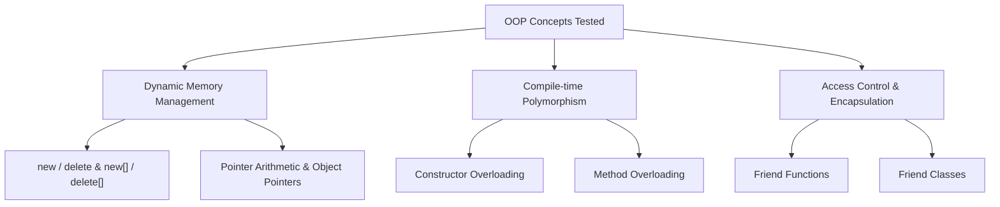

# 🧪 Object Oriented Programming Laboratory – Test 1

<div align="center">


-informational?style=for-the-badge)
-crimson?style=for-the-badge)


[](https://gcc.gnu.org/)
[](#-problems-index--progress)
[](#)
[](./OOP_LAB_TEST_B1_SET_A.pdf)

<p align="center">
  <b>Department of Computer Science and Engineering</b><br>
  <b>International Institute of Information Technology, Bhubaneswar</b>
</p>

---

</div>

## 📑 Table of Contents

- [📖 Test Overview & Key Directives](#-test-overview--key-directives)
- [🧠 Concepts Covered](#-concepts-covered)
- [📊 Problems Index & Progress](#-problems-index--progress)
- [📝 Detailed Problem Breakdown](#-detailed-problem-breakdown)
  - [1. Smart Locker Allocation](#1-smart-locker-allocation)
  - [2. Drone Battery Monitor](#2-drone-battery-monitor)
  - [3. Movie Queue Display](#3-movie-queue-display)
  - [4. Laboratory Instrument Access](#4-laboratory-instrument-access)
  - [5. E-Wallet Transaction Record](#5-e-wallet-transaction-record)
- [🏗️ Directory Architecture](#️-directory-architecture)
- [⚙️ Compilation & Execution Guide](#️-compilation--execution-guide)
- [👥 Verification & Authors](#-verification--authors)

---

## 📖 Test Overview & Key Directives

This repository directory contains the complete set of solutions for **Lab 7 – Test on OOP Concepts (Set A)** conducted for B.Tech 3rd Semester (Group 1).

### 📋 Official Test Instructions:
1. **Language:** All solutions strictly implemented in **C++** (C++17/20 standard).
2. **OOP Paradigms:** Implement the specific OOP concepts mandated in each question (encapsulation, function overloading, friend functions, friend classes).
3. **Dynamic Memory Allocation:** Allocate resources dynamically at runtime using `new` and `new[]`.
4. **Memory Safety:** Properly deallocate all heap resources using `delete` and `delete[]`, resetting pointers to `nullptr`.
5. **Code Style:** All codebase strictly formatted in **Allman brace style**.
6. **Readable Output:** Format input prompts and terminal outputs cleanly.



---

## 🧠 Concepts Covered

| Concept | Description | Questions Applied |
| :--- | :--- | :---: |
| **Dynamic Array of Objects** | Allocating contiguous objects on the heap whose count is known at runtime | `Q1`, `Q3` |
| **Pointers & Arrow (`->`) Operator** | Accessing and modifying members through explicit pointer references | `Q1`, `Q2`, `Q3`, `Q4`, `Q5` |
| **Function Overloading** | Multiple member functions sharing the same identifier differentiated by signature | `Q1`, `Q2`, `Q5` |
| **Friend Functions** | Non-member functions granted access to `private` data without getters | `Q2`, `Q3`, `Q5` |
| **Friend Classes** | Granting an entire external controller class privileged access to internal state | `Q4` |
| **Destructors & Cleanup** | Releasing dynamic arrays within class destructors to ensure zero memory leaks | `Q1`, `Q3`, `Q5` |

---

## 📊 Problems Index & Progress

| # | Problem Title | Primary OOP Feature | Code | Execution Output | Status |
| :---: | :--- | :--- | :---: | :---: | :---: |
| **01** | [Smart Locker Allocation](#1-smart-locker-allocation) | Dynamic Object Array, Overloaded `setCode()`, Pointers | [`main.cpp`](./Q1_Smart_Locker_Allocation/main.cpp) | [`output.txt`](./Q1_Smart_Locker_Allocation/output.txt) | <span style="color:green">✔ **Completed**</span> |
| **02** | [Drone Battery Monitor](#2-drone-battery-monitor) | Dynamic Objects, Overloaded `update()`, Friend Function | [`main.cpp`](./Q2_Drone_Battery_Monitor/main.cpp) | [`output.txt`](./Q2_Drone_Battery_Monitor/output.txt) | <span style="color:green">✔ **Completed**</span> |
| **03** | [Movie Queue Display](#3-movie-queue-display) | Dynamic Queue Array, Friend Function `exchange()` | [`main.cpp`](./Q3_Movie_Queue_Display/main.cpp) | [`output.txt`](./Q3_Movie_Queue_Display/output.txt) | <span style="color:green">✔ **Completed**</span> |
| **04** | [Laboratory Instrument Access](#4-laboratory-instrument-access) | Friend Class (`LabSupervisor`), Private Member Mutation | [`main.cpp`](./Q4_Laboratory_Instrument_Access/main.cpp) | [`output.txt`](./Q4_Laboratory_Instrument_Access/output.txt) | <span style="color:green">✔ **Completed**</span> |
| **05** | [E-Wallet Transaction Record](#5-e-wallet-transaction-record) | Dynamic Float Array, Overloaded `transaction()`, Friend Function | [`main.cpp`](./Q5_E-Wallet_Transaction_Record/main.cpp) | [`output.txt`](./Q5_E-Wallet_Transaction_Record/output.txt) | <span style="color:green">✔ **Completed**</span> |

---

## 📝 Detailed Problem Breakdown

### 1. Smart Locker Allocation
* **Directory:** [`Q1_Smart_Locker_Allocation/`](./Q1_Smart_Locker_Allocation/)
* **Files:** [`main.cpp`](./Q1_Smart_Locker_Allocation/main.cpp) | [`output.txt`](./Q1_Smart_Locker_Allocation/output.txt)
* **Objective:** Manage hostel lockers whose quantity $n$ is determined at runtime.
* **Key Implementations:**
  - Class `Locker` with private members: `lockerNo`, `occupied`, and dynamically allocated `char* code`.
  - Overloaded `setCode(const char* newCode)` to replace the entire code.
  - Overloaded `setCode(int pos, char ch)` to modify the code character at a specific 0-based index.
  - Traversal and manipulation using pointer arithmetic `(lockers + i)->...` and `Locker *p`.
  - Destructor freeing dynamically allocated string memory.

---

### 2. Drone Battery Monitor
* **Directory:** [`Q2_Drone_Battery_Monitor/`](./Q2_Drone_Battery_Monitor/)
* **Files:** [`main.cpp`](./Q2_Drone_Battery_Monitor/main.cpp) | [`output.txt`](./Q2_Drone_Battery_Monitor/output.txt)
* **Objective:** Monitor battery levels and flight hours across drones instantiated on the heap.
* **Key Implementations:**
  - Overloaded `update(float b)` to update only battery percentage.
  - Overloaded `update(float b, float h)` to update both battery and flight hours.
  - Non-member friend function `compareBattery(Drone, Drone)` accessing private `battery` and `id` to evaluate which drone has higher charge.
  - Dynamic allocation via `new Drone`, access via `->`, and safe cleanup via `delete`.

---

### 3. Movie Queue Display
* **Directory:** [`Q3_Movie_Queue_Display/`](./Q3_Movie_Queue_Display/)
* **Files:** [`main.cpp`](./Q3_Movie_Queue_Display/main.cpp) | [`output.txt`](./Q3_Movie_Queue_Display/output.txt)
* **Objective:** Maintain waiting queues of dynamic lengths and exchange queue information between objects.
* **Key Implementations:**
  - Class `QueueDisplay` encapsulating dynamic customer ID arrays (`int *ids`) of variable size.
  - Member functions `insert(index, id)` and `display()`.
  - Friend function `exchange(QueueDisplay &q1, QueueDisplay &q2)` swapping underlying pointers and sizes directly without deep-copy overhead.
  - Dynamically allocated array of objects: `new QueueDisplay[2]`.

---

### 4. Laboratory Instrument Access
* **Directory:** [`Q4_Laboratory_Instrument_Access/`](./Q4_Laboratory_Instrument_Access/)
* **Files:** [`main.cpp`](./Q4_Laboratory_Instrument_Access/main.cpp) | [`output.txt`](./Q4_Laboratory_Instrument_Access/output.txt)
* **Objective:** Enforce access control where a supervisor can inspect and modify private attributes without exposing them publicly.
* **Key Implementations:**
  - Class `Instrument` containing `id`, `name`, and `private accessLevel`.
  - Declares `friend class LabSupervisor;`.
  - Class `LabSupervisor` with methods `checkAccess(Instrument *i)` and `modifyAccess(Instrument *i, int newLevel)` operating directly on private members.
  - Dynamic allocation of `Instrument` object.

---

### 5. E-Wallet Transaction Record
* **Directory:** [`Q5_E-Wallet_Transaction_Record/`](./Q5_E-Wallet_Transaction_Record/)
* **Files:** [`main.cpp`](./Q5_E-Wallet_Transaction_Record/main.cpp) | [`output.txt`](./Q5_E-Wallet_Transaction_Record/output.txt)
* **Objective:** Maintain wallet balances and transaction logs with overloaded operations and comparative friend evaluation.
* **Key Implementations:**
  - Class `Wallet` containing dynamic transaction log array `double *transactions`.
  - Overload 1: `transaction(double amount)` depositing or withdrawing based on sign ($\pm$).
  - Overload 2: `transaction(double amount, char type)` accepting amount and type code (`'D'` or `'W'`).
  - Friend function `compareWallet(const Wallet&, const Wallet&)` determining the higher balance without any public getter function.
  - Strict memory cleanup in `~Wallet()`.

---

## 🏗️ Directory Architecture

```plaintext
LAB6_TEST/
│
├── 📄 README.md                                # Comprehensive Test Documentation
├── 📕 OOP_LAB_TEST_B1_SET_A.pdf                # Official Problem Sheet (Set A)
├── 🐍 folder.py                                # Directory setup script
│
├── 📂 Q1_Smart_Locker_Allocation/
│   ├── main                                    # Compiled executable
│   ├── main.cpp                                # Locker class & pointer access
│   └── output.txt                              # Execution output
│
├── 📂 Q2_Drone_Battery_Monitor/
│   ├── main                                    # Compiled executable
│   ├── main.cpp                                # Overloaded update & compareBattery
│   └── output.txt                              # Execution output
│
├── 📂 Q3_Movie_Queue_Display/
│   ├── main                                    # Compiled executable
│   ├── main.cpp                                # QueueDisplay & exchange friend function
│   └── output.txt                              # Execution output
│
├── 📂 Q4_Laboratory_Instrument_Access/
│   ├── main                                    # Compiled executable
│   ├── main.cpp                                # Instrument & LabSupervisor friend class
│   └── output.txt                              # Execution output
│
└── 📂 Q5_E-Wallet_Transaction_Record/
    ├── main                                    # Compiled executable
    ├── main.cpp                                # Wallet, overloaded transaction & compareWallet
    └── output.txt                              # Execution output
```

---

## ⚙️ Compilation & Execution Guide

### Using Clang / GCC:

To compile and run any question individually from the repository root:

```bash
# Question 1
clang++ -std=c++17 -Wall LAB6_TEST/Q1_Smart_Locker_Allocation/main.cpp -o LAB6_TEST/Q1_Smart_Locker_Allocation/main
./LAB6_TEST/Q1_Smart_Locker_Allocation/main

# Question 2
clang++ -std=c++17 -Wall LAB6_TEST/Q2_Drone_Battery_Monitor/main.cpp -o LAB6_TEST/Q2_Drone_Battery_Monitor/main
./LAB6_TEST/Q2_Drone_Battery_Monitor/main

# Question 3
clang++ -std=c++17 -Wall LAB6_TEST/Q3_Movie_Queue_Display/main.cpp -o LAB6_TEST/Q3_Movie_Queue_Display/main
./LAB6_TEST/Q3_Movie_Queue_Display/main

# Question 4
clang++ -std=c++17 -Wall LAB6_TEST/Q4_Laboratory_Instrument_Access/main.cpp -o LAB6_TEST/Q4_Laboratory_Instrument_Access/main
./LAB6_TEST/Q4_Laboratory_Instrument_Access/main

# Question 5
clang++ -std=c++17 -Wall LAB6_TEST/Q5_E-Wallet_Transaction_Record/main.cpp -o LAB6_TEST/Q5_E-Wallet_Transaction_Record/main
./LAB6_TEST/Q5_E-Wallet_Transaction_Record/main
```

### Memory Verification (AddressSanitizer):

```bash
clang++ -std=c++17 -fsanitize=address -g LAB6_TEST/Q1_Smart_Locker_Allocation/main.cpp -o main_asan
./main_asan
```

---

## 👥 Verification & Authors

* **Course:** Object-Oriented Programming (OOP) Laboratory
* **Academic Term:** B.Tech 3rd Semester (Group 1, Section CSE B1)
* **Institution:** International Institute of Information Technology, Bhubaneswar
* **Reference Document:** [`OOP_LAB_TEST_B1_SET_A.pdf`](./OOP_LAB_TEST_B1_SET_A.pdf)

<div align="center">

**Made with ❤️ for Object Oriented Programming in C++**

</div>
